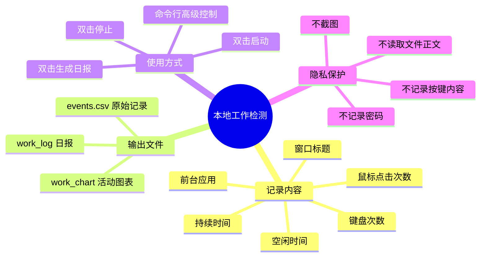

# 🧭 本地工作内容自动检测工具

这是一个运行在 **Windows 本地后台** 的工作记录工具，用来统计你一天里主要在使用哪些软件、窗口和任务。

它的目标很简单：**帮你自动生成每日工作轨迹和活动图表**，方便复盘今天把时间花在了哪里。

---

## 🌟 功能速览



如果你的 Markdown 预览器不支持 Mermaid，也可以看这版纯文本导图：

```text
本地工作检测
├─ 📝 记录：应用、窗口标题、持续时间、键盘次数、鼠标点击次数、空闲时间
├─ 📊 输出：日报 TXT、活动图 SVG、原始记录 CSV
├─ 🖱️ 使用：启动、生成日报、停止，都可以双击完成
└─ 🔐 隐私：不记录输入内容、不截图、不读取文件正文
```

---

## 🔐 隐私说明

工具会记录：

- ✅ 当前前台应用名称
- ✅ 当前窗口标题
- ✅ 每段窗口持续时间
- ✅ 键盘输入次数
- ✅ 鼠标点击次数
- ✅ 长时间无键盘鼠标操作后的空闲时间

工具不会记录：

- ❌ 具体按了哪些键
- ❌ 键盘输入内容
- ❌ 密码
- ❌ 屏幕截图
- ❌ 文件内容
- ❌ 浏览器网页正文

---

## 🚀 快速使用

### 1. 启动后台记录

双击：

```text
start_background.vbs
```

启动成功或失败都会弹出提示。记录程序会在后台静默运行。

### 2. 生成今天的日报

双击：

```text
generate_today_report.bat
```

窗口里会询问是否生成后立即打开日报与活动总览；选择 `Y` 后会打开文字日报和汇集全部日期图表的总览网页。

### 3. 停止后台记录

双击：

```text
stop_tracker.bat
```

停止时会自动生成今天的日报、图表并刷新活动总览网页。

---

## 🔁 日常使用流程

```text
上班 / 开始工作
    ↓
双击 start_background.vbs
    ↓
后台自动记录前台窗口与活动次数
    ↓
下班 / 想复盘
    ↓
双击 generate_today_report.bat
    ↓
查看 data 文件夹里的日报和活动总览
    ↓
双击 stop_tracker.bat 停止记录
```

---

## 📁 输出文件

生成的数据都在 `data` 文件夹中：

| 文件 | 说明 |
| --- | --- |
| `events.csv` | 原始记录，包含每段窗口的时间、应用、标题、键盘次数和鼠标次数 |
| `work_log_YYYY-MM-DD.txt` | 每日文字版工作报告 |
| `work_chart_YYYY-MM-DD.svg` | 每日活动图表，可用浏览器打开 |
| `activity_dashboard.html` | 汇总所有已生成每日图表的总览网页 |
| `runtime.log` | 运行日志 |
| `startup.log` | 启动日志 |
| `status.log` | 状态检查日志 |

---

## 💻 命令行用法

### 前台运行记录

```powershell
python work_tracker.py run
```

### 生成今天日报

```powershell
python work_tracker.py report --day today
```

会同时生成：

```text
data/work_log_YYYY-MM-DD.txt
data/work_chart_YYYY-MM-DD.svg
data/activity_dashboard.html
```

如需生成后立即打开文字日报与活动总览网页：

```powershell
python work_tracker.py report --day today --open
```

### 生成指定日期日报

```powershell
python work_tracker.py report --day 2026-05-08
```

### 停止记录

```powershell
python work_tracker.py stop
```

### 查看后台记录状态

```powershell
python work_tracker.py status
```

### 补生成历史缺失日报

```powershell
python work_tracker.py backfill
```

---

## ⚙️ 参数配置

### 调整空闲判定时间

默认 **5 分钟** 无键盘鼠标操作算空闲。可以改成 180 秒：

```powershell
python work_tracker.py run --idle-after-seconds 180
```

### 调整键盘鼠标计数轮询间隔

默认每 **0.05 秒** 轮询一次，只统计次数，不保存具体按键：

```powershell
python work_tracker.py run --activity-poll-seconds 0.03
```

### 调整每日自动生成报告时间

默认每天 **23:59** 自动生成当天日报：

```powershell
python work_tracker.py run --daily-report-time 18:30
```

### 关闭自动生成日报

```powershell
python work_tracker.py run --daily-report-time off
```

---

## 🧩 自动补报告机制

启动后台记录时，程序会自动检查今天以前是否有缺失的日报或图表。

例如昨天关机前没有来得及生成报告，第二天启动时会自动补生成。

也可以手动补生成：

```powershell
python work_tracker.py backfill
```

---

## 🖥️ 开机自启动

1. 按 `Win + R`
2. 输入：

```text
shell:startup
```

3. 把 `start_background.vbs` 的快捷方式放进去

之后 Windows 登录后就会自动启动后台记录。

---

## 🧠 一句话总结

> 这是一个本地、轻量、隐私友好的工作轨迹记录器：自动记录你用过什么窗口、花了多久、活动是否密集，并生成每日复盘报告。
